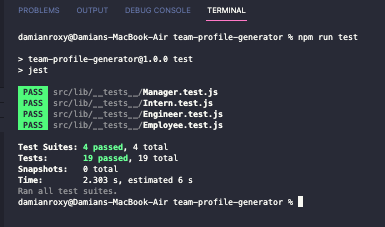
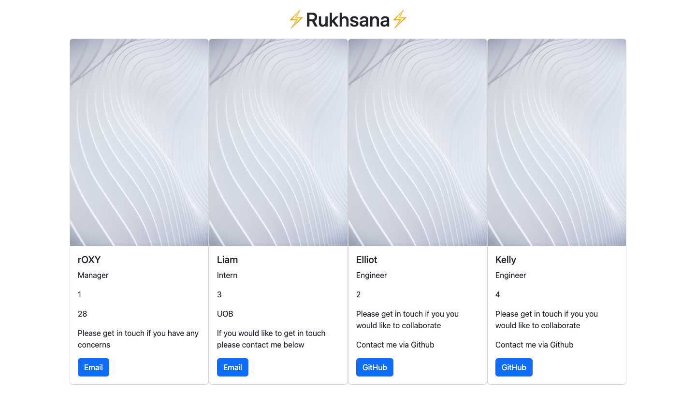

# Title: team-profile-generator


- [Description](#description)
- [Installation](#installation)
- [Video Link](#video-link)
- [Screenshots](#screenshots)
- [Technologies](#technologies)
- [Contact me](#contact-me)

# Description 📕

## A command line application which takes info to generate a html webpage which displays team profiles

AS A managerI want to generate a webpage that displays my team's basic info so that I have quick access to their emails and GitHub profiles.

Given a command-line application that accepts user input. When I am prompted for my team members and their information then an HTML file is generated that displays a nicely formatted team roster based on user input.

When I click on an email address in the HTML
then my default email program opens and populates the TO field of the email with the address.

When I click on the GitHub username then that GitHub profile opens in a new tab.

When I start the application then I am prompted to enter the team manager’s name, employee ID, email address, and office number.

When I enter the team manager’s name, employee ID, email address, and office number then I am presented with a menu with the option to add an engineer or an intern or to finish building my team.

When I select the engineer option then I am prompted to enter the engineer’s name, ID, email, and GitHub username, and I am taken back to the menu.

When I select the intern option then I am prompted to enter the intern’s name, ID, email, and school, and I am taken back to the menu.

When I decide to finish building my team then I exit the application, and the HTML is generated.

# Installation 🔍

Install the project using these steps:

```

git clone git@github.com:roxywasiak/team-profile-generator.git

cd team-profile-generator

npm run start

```

# Video link

Watch the video walk-through of the application [CLICK](https://drive.google.com/file/d/1yS4OJqwR50kMKpG78dMyGWl3djCBoi21/view?usp=sharing)

# Screenshots 📸

## Tests 🗂



## Application



# Technologies 🖥

HTML , JavaScript, Bootstrap, node.js, Inquirer, jest.js (TDD)

## Contact Me 👋

## If you require more information about this application just drop me an [email](mailto:ruksclone@hotmail.com).
